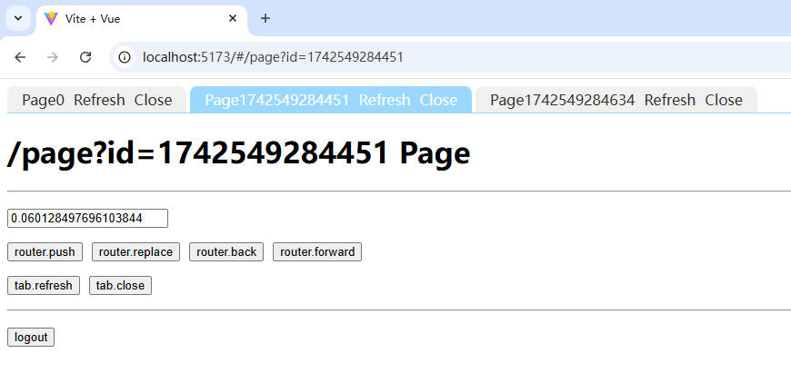

# vue-tab-page

[English](README.md) [中文](README.zh-CN.md)

## Preview



## Instructions

### main.js

```js
import { createApp } from 'vue';
import { router } from './router';
import { createTabPage } from 'vue-tab-page';
import App from './App.vue';

createApp(App)
  .use(router)
  .use(createTabPage(), { router, blank: { name: 'Blank' } }) // Create and Register vue-tab-page.
  .mount('#app');
```

### App.vue

```vue
<template>
  <!-- Tab Page switching bar. -->
  <vue-tab-page-bar>
    <template v-slot="{ tab, index }">
      <div @click="tab.active()" :class="{ active: tab.fullPath == $route.fullPath }">
        <div>{{tab.title}}</div>
        <div @click.stop="tab.refresh()">Refresh</div>
        <div @click.stop="tab.close('right')">Close</div>
      </div>
    </template>
  </vue-tab-page-bar>
  <!-- Tab Page content. -->
  <vue-tab-page-content></vue-tab-page-content>
</template>
```

### Page.vue

```vue
<template>
  <div>
    <h1>{{ route.fullPath }} Page</h1>
    <hr />
    <p><input v-model="input" /></p>
    <p style="display: flex; gap: 10px;">
      <button @click="push">router.push</button>
      <button @click="replace">router.replace</button>
      <button @click="back">router.back</button>
      <button @click="forward">router.forward</button>
    </p>
    <p style="display: flex; gap: 10px;">
      <button @click="refresh">tab.refresh</button>
      <button @click="close">tab.close</button>
    </p>
    <hr />
    <p><button @click="onLogout">logout</button></p>
  </div>
</template>

<script setup>
import { ref } from 'vue';
import { useRouter, useRoute } from 'vue-router';
import { useTab, onTabMounted, onTabActivated, onTabDeactivated, onTabBeforeUnmount } from 'vue-tab-page';

const router = useRouter();
const route = useRoute();

const input = ref(null);

// Get current label bar information.
const tab = useTab();

// Open a new tab..
const push = async () => {
  router.push({ name: 'Page', query: { id: Date.now() }, state: { data: [{a:1}] } });
};

// Replace the current label
const replace = async () => {
  router.replace({ name: 'Page', query: { id: Date.now() }, state: { data: [{a:1}] } });
};

// Back.
const back = async () => {
  router.back();
};

// Forward.
const forward = async () => {
  router.forward();
};

// Refresh.
const refresh = () => {
  tab.refresh();
};

// Close the current tag and back.
const close = () => {
  tab.close('back');
};

// When the tab is opened.
onTabMounted(() => {
  tab.title = tab.meta.title + tab.query.id;
  input.value = Math.random();
  console.log(tab.query.id, 'onMounted');
});

// When the tab is displayed.
onTabActivated(() => {
  console.log(tab.query.id, 'onActivated');
});

// When the tab is hidden.
onTabDeactivated(() => {
  console.log(tab.query.id, 'onDeactivated');
});

// When the tag page is destroyed.
onTabBeforeUnmount(() => {
  console.log(tab.query.id, 'onBeforeUnmount');
});
</script>
```
